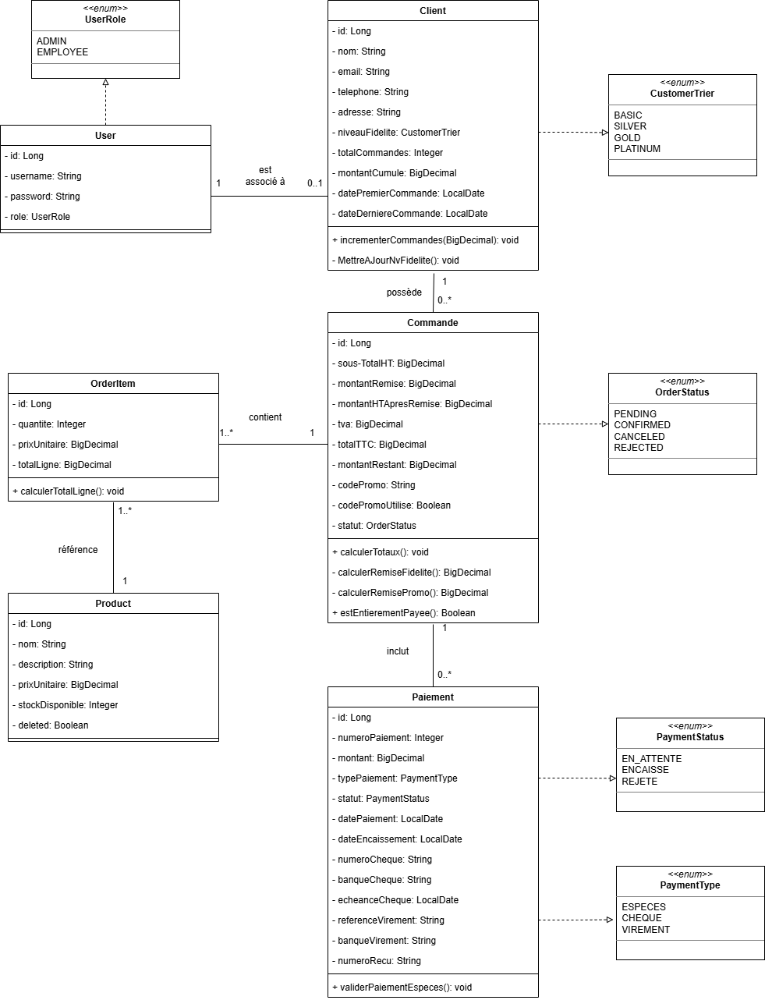
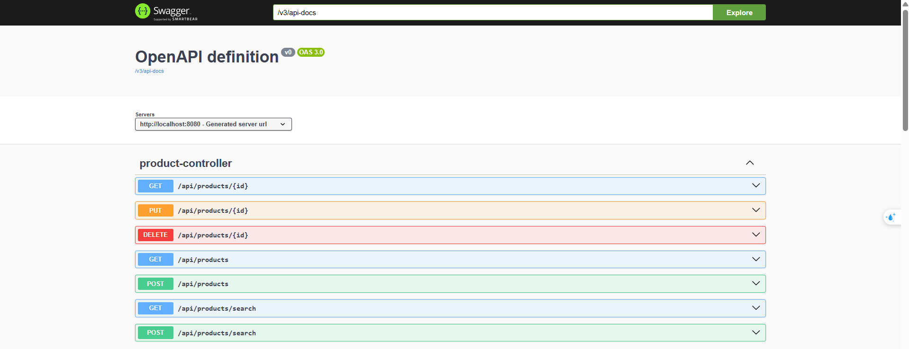
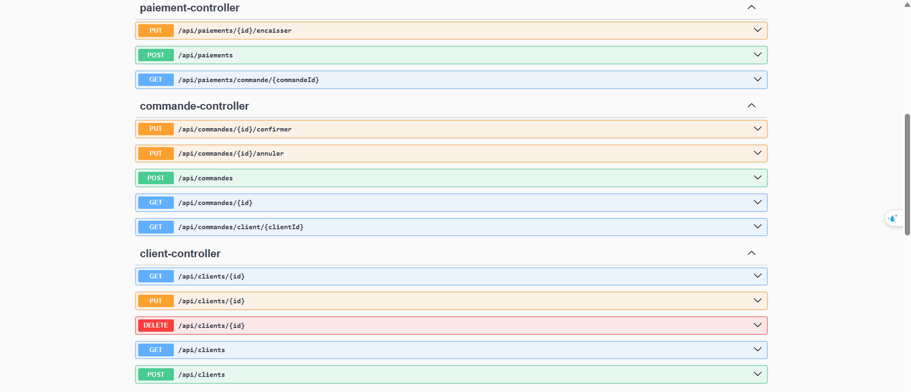
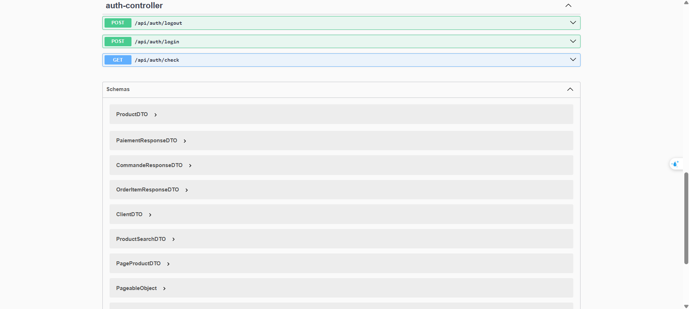
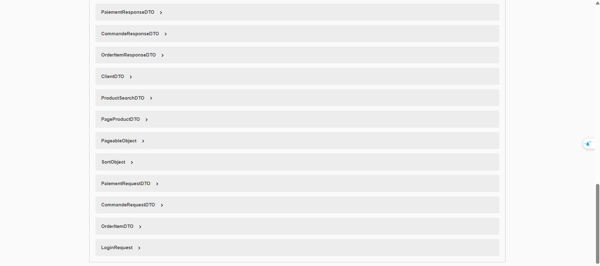

# 🛒 SmartShop - Application de Gestion Commerciale B2B

<div align="center">


**Solution backend REST pour la gestion commerciale de MicroTech Maroc**

</div>

## 🌟 Fonctionnalités

### 🔧 Fonctionnalités Techniques
- **Backend RESTful** : API pour toutes les opérations (clients, produits, commandes, paiements)
- **Authentification par Session HTTP** : login/logout, gestion des rôles (ADMIN / CLIENT)
- **Validation Métier** : contraintes sur stock, niveaux de fidélité, codes promo et TVA
- **Tests Unitaires** : Couverture avec JUnit 5 et Mockito
- **Documentation API** : Swagger UI pour tester toutes les endpoints

### 📦 Gestion des Ressources
- ✅ **Clients** : CRUD complet + suivi historique commandes et statistiques
- ✅ **Produits** : Ajout, modification, suppression (soft delete si commandes existantes)
- ✅ **Commandes** : Création multi-produits, application de remises et calcul automatique
- ✅ **Paiements** : Multi-moyens, paiements fractionnés, suivi des statuts
- ✅ **Système de fidélité** : Niveaux BASIC, SILVER, GOLD, PLATINUM avec remises automatiques

---

## 🛠️ Stack Technique

| Composant | Version | Usage |
|-----------|---------|--------|
| **Java** | 17 | Langage principal |
| **Spring Boot** | 3.5.8 | Framework backend |
| **Spring Data JPA** | 3.5.8 | Persistance des données |
| **PostgreSQL** | 15 | Base de données relationnelle |
| **Maven** | 3.9+ | Gestion des dépendances |
| **SpringDoc OpenAPI** | 2.7.0 | Documentation API Swagger |
| **JUnit 5** | 5.10+ | Tests unitaires |
| **Mockito** | 5.11+ | Mocking pour les tests |
| **Lombok** | 1.18.30 | Simplification des entités |
| **MapStruct** | 1.5.5.Final | Conversion entités / DTO |

---

## 🚀 Démarrage Rapide

### Prérequis
- **JDK 17** ou supérieur
- **Maven 3.9** ou supérieur
- **PostgreSQL** installé et configuré

### Installation & Exécution

1. **Cloner le repository**
```bash
git clone https://github.com/ichrakjaifra/smartshop.git
cd smartshop
```
2. **Configurer la base de données**
```
spring.datasource.url=jdbc:postgresql://localhost:5432/smartshop
spring.datasource.username=postgres
spring.datasource.password=VOTRE_MOT_DE_PASSE_DB
```
3. **Construire le projet**
```
mvn clean install
```
4. **Lancer l'application**
```
mvn spring-boot:run
```
5. **Accéder à l'application**
```
API : http://localhost:8080
Swagger UI : http://localhost:8080/swagger-ui.html
```
## 💾 Modèle de Données

## Entités Principales

User : id, username, password, role (ADMIN / CLIENT)

Client : id, nom, email, niveau de fidélité

Product : id, nom, prix unitaire, stock disponible

Commande : id, client, liste d’articles, date, sous-total, remise, TVA, total, code promo, statut, montant_restant

OrderItem : id, produit, quantité, prix unitaire, total ligne

Paiement : id, commande, numéro, montant, type_paiement, date_paiement, date_encaissement

## Enums

UserRole : ADMIN, CLIENT

CustomerTier : BASIC, SILVER, GOLD, PLATINUM

OrderStatus : PENDING, CONFIRMED, CANCELED, REJECTED

PaymentStatus : EN_ATTENTE, ENCAISSÉ, REJETÉ

## Relations entre entités

Un Client possède plusieurs Commandes

Une Commande contient plusieurs OrderItem

Un OrderItem référence un Product

Une Commande peut avoir plusieurs Paiements

Un User est associé à un Client (si rôle CLIENT)

## diagramme de classe 


## 📚 API Documentation




